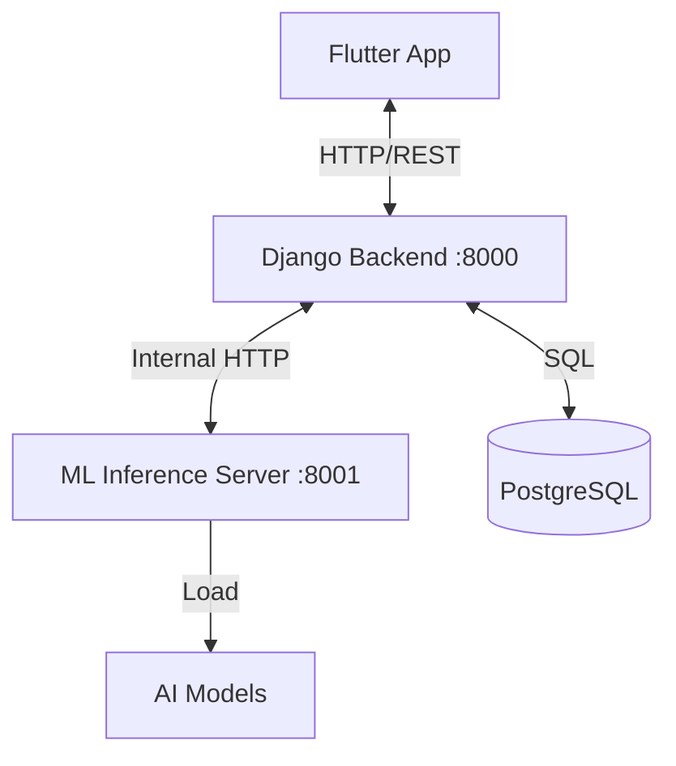

# System Architecture

## 1. High-Level Overview

The Mental Health App helps users track their mental well-being through a tri-modal approach (Text, Audio, Video). It consists of three main coupled components:

1.  **Mobile/Web Frontend (Flutter)**: The user interface.
2.  **Backend API (Django)**: Handles business logic, database, and authentication.
3.  **ML Inference Server (FastAPI)**: A dedicated high-performance server for AI analysis.



---

## 2. Technology Stack

| Component | Technology | Key Libraries |
| :--- | :--- | :--- |
| **Frontend** | Flutter (Dart) | `http`, `flutter_secure_storage`, `audioplayers`, `camera`, `fl_chart`, `google_fonts` |
| **Backend** | Django 4.2 (Python) | `djangorestframework`, `simplejwt`, `corsheaders`, `dj_database_url`, `whitenoise` |
| **ML Server** | FastAPI (Python) | `uvicorn`, `torch` (PyTorch), `transformers`, `librosa`, `opencv`, `deepface` |
| **Database** | PostgreSQL | `psycopg2-binary` |

---

## 3. Component Architecture

### A. Frontend (Flutter App)
The frontend is built with Flutter to support both Mobile (Android/iOS) and Web.

*   **Authentication**: Uses JWT (JSON Web Tokens). Tokens are stored securely using `flutter_secure_storage`.
*   **Services Layer**:
    *   `ApiService`: Centralized class for all HTTP requests. Automatically handles base URL switching and token injection.
*   **Modules**:
    *   **Auth**: Login, Signup, Forgot Password.
    *   **Dashboard**: Main hub with navigation.
    *   **Mood Tracker**: Emoji-based logging with tags and notes.
    *   **Chatbot**: Interface for chatting with the AI assistant.
    *   **Stress Buster**: Records audio/video journal entries for AI analysis.
    *   **Resources**: Affirmations, Meditations (Audio), Yoga (Video).

### B. Backend API (Django)
The Django backend acts as the orchestrator. It manages user data and proxies complex AI tasks to the ML server.

*   **Port**: `8000`
*   **Key Apps**:
    *   `auth_api`: Custom User model, Registration with Medical History field, Guardian details.
    *   `mood_tracker`: CRUD operations for mood logs.
    *   `chatbot`: Stores chat history and connects to external LLM APIs (e.g., Groq) if configured, or uses internal logic.
    *   `affirmations`: Delivers categorized and generic affirmations.
*   **Security**:
    *   `CORS`: Configured to allow mobile/web clients.
    *   `JWT`: `rest_framework_simplejwt` for stateless authentication.

### C. ML Inference Server (FastAPI)
A lightweight, async server dedicated to running heavy PyTorch models.

*   **Port**: `8001`
*   **Core Logic (`main.py`)**:
    *   **Async/Parallel Inference**: Uses `asyncio` to run Face, Voice, and Text analysis concurrently to reduce latency.
*   **Endpoints**:
    *   `/predict/face`: Analyzes facial expressions from images.
    *   `/predict/audio`: Analyzes vocal prosody/emotion from audio files.
    *   `/predict/text`: Analyzes sentiment/emotion from text.
    *   `/predict/multimodal`: accepts all three inputs, runs them in parallel, and fuses the results.
*   **Fusion Logic**:
    *   Weighted averaging of probabilities from the three models to produce a final emotional state (e.g., "70% Happy, 30% Neutral").

---

## 4. Data Flow Examples

### Scenario: User submits a "Stress Buster" Journal Entry

1.  **Capture**: The **Flutter App** records the user's voice (audio), captures a selfie (image), and asks for a text note.
2.  **Upload**: The App sends a `POST` request to Django's `/api/sessions/stress-buster/` endpoint with the files and text.
3.  **Processing (Django)**:
    *   Django saves the raw session data in PostgreSQL.
    *   Django makes an internal HTTP `POST` request to the **ML Server**'s `/predict/multimodal` endpoint.
4.  **Inference (ML Server)**:
    *   **Face Model**: Detects emotion from the image (e.g., Sad).
    *   **Voice Model**: Detects emotion from the audio wave (e.g., Fear).
    *   **Text Model**: Detects sentiment from the note (e.g., Negative).
    *   **Fusion**: Combines these into a detailed report.
5.  **Response**: The ML Server returns the analysis to Django.
6.  **Storage**: Django updates the session record with the AI feedback.
7.  **Feedback**: Django responds to the Flutter App, which displays the AI's analysis and recommendations to the user.

---

## 5. Directory Structure

```text
Root/
├── mental_health_app_frontend/    # Flutter Code
│   ├── lib/
│   │   ├── services/              # API and logic
│   │   ├── screens/               # UI Pages
│   │   └── widgets/               # Reusable UI components
├── mental_health_backend/         # Django Project Root
│   ├── auth_api/                  # User Management
│   ├── mood_tracker/              # Mood Logic
│   └── ...
├── ml_inference_server/           # FastAPI Project
│   ├── models/                    # .pt PyTorch models
│   ├── services/                  # Inference logic (inference.py, fusion.py)
│   └── main.py                    # Server entry point
└── manage.py                      # Django entry point
```
