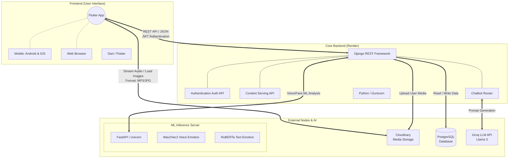

# System Architecture: MAA Mental Health App

## 🏗️ 1. Architecture Overview
This application utilizes a modern, multi-tiered architecture that separates the user interface, routing logic, machine learning inference, and data storage into distinct, scalable components. 

Below is a visual representation of the architecture:

---

## 📚 2. System Components Breakdown

### A. The Client Tier (Frontend)
* **Technology:** Flutter (Dart)
* **Role:** The beautiful, interactive face of your app. It handles UI rendering, smooth animations (like breathing exercises), audio playback, and local device capabilities.
* **Platforms:** Runs natively on Android, iOS, and Web environments.

### B. The Application Tier (Core Backend)
* **Technology:** Django & Django REST Framework (DRF)
* **Hosting:** Render
* **Role:** The central "brain" connecting all micro-services. It provides the RESTful APIs that the Flutter app talks to. It handles secure user logins (JWT Tokens), fetches your seeded content (Yoga, Meditation, CBT), and delegates analytical tasks.

### C. The Intelligence Tier (AI & ML)
The application utilizes a highly advanced **Dual-AI Architecture**:
* **Generative AI:** The Django backend connects to the **Groq API (Llama 3)** to power your fast Therapy Chatbot and provide dynamic Cognitive Behavioral Therapy (CBT) session feedback.
* **Inference Server:** A custom, separate ML server (`ml_inference_server`) that runs **PyTorch** models. It isolates heavy processing (`wav2vec2` for voice and `roberta` for text) dedicated strictly to classifying human emotions.

### D. The Data & Storage Tier
* **Relational Database:** **PostgreSQL** (Hosted on Render). Stores all relational user data, streaks, journal entries, and content definitions text.
* **Blob Media Storage:** **Cloudinary**. A specialized server that handles heavy media files forever. It securely stores MP3 meditation clips, user profile pictures, and therapy drawing images outside of the main Render server, ensuring maximum bandwidth and application speed.
